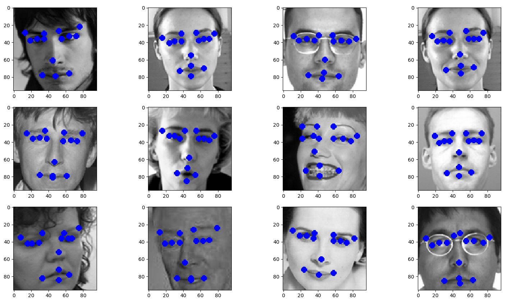
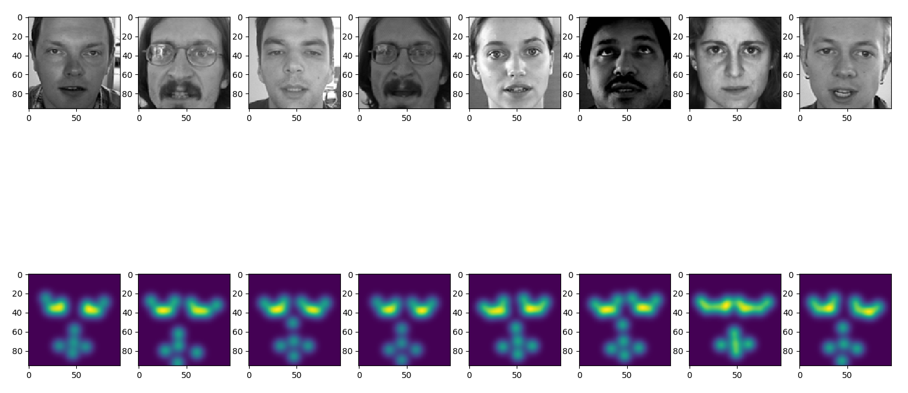

## Overview
In this repository, I explore various CNN architectures that can be used to detect keypoints in an image. I worked with [Kaggle's Facial Keypoints](https://www.kaggle.com/c/facial-keypoints-detection) dataset. My choice of architectures and loss functions were based on methods developed in [1]-[3] for pose estimation and facial landmarks.

## Data
The original dataset consists of 7049 training images. Each image is grayscale and sized at a 96x96 resolution.
However, there is an uneven distribution of # keypoints / image throughout the training set, with images having either 4 or 15 keypoints per image. Specifically, 2140 images were annotated with 15 keypoints / image, while the remaining 4909 images had 4 keypoints per image. Examples of the original ground-truth images & keypoints are shown below:

I trained my models on the 15-keypoint subset of training images. The script [here] extracts each corresponding image from the full training set and saves it to a user-specified directory.

## Architecture
Similar to object detection, keypoint detection can be treated as a regression problem. The design question in terms of architecture then becomes whether the network should 1) directly predict the keypoint locations or 2) predict an intermediary representation that keypoints can then be inferred from.

### Direct Regression
With this method, FC layers are added directly on top of a standard classification backbone network like VGG or ResNet. The number of units in the final FC layer corresponds to the 2x*NKeypoints* (in our case 30). 

I trained two models using this approach where the two backbone architectures were inspired by VGG-16 [4] and ResNet[5].

### Heatmap Regression 
Alternatively, keypoint information can be combined together with the raw image to form a heatmap. Each pixel location (i,j) in the heatmap stores a value representing the probability of that location being a keypoint. Therefore, the input to a network is no longer a 96x96x1 grayscale image but instead a 96x96x15 heatmap tensor, where each channel along the input tensor's depth corresponds to a unique keypoint heatmap. 

To convert the training images to heatmaps, use the following procedure:
   1) For the nth keypoint, create a [gaussian kernel](https://en.wikipedia.org/wiki/Radial_basis_function_kernel) centred at       the (i,j)location of that keypoint.
   2) Apply the kernel to every (i,j) location in the original image. 
   3) Repeat steps 1-2 *Nkeypoints* times, updating the gaussian kernel with a new centre location. For each iteration,             concatentate the resulting single-channel heatmap with the previous heatmaps.

Examples of ground-truth images and their corresponding heatmaps are shown below:

Conceptually, heatmap prediction is similar to semantic segmentation, where a network both inputs and outputs a mask tensor. The main difference with heatmap prediction is that the channels of a typical segmentation output tensor correspond to object classes, whereas our prediction will correpsond to individual keypoint heatmaps. I created two models based on the popular FCN[6] and Unet[7] architectures that have previously been used for semantic segmentation tasks. 

Finally, the predicted heatmaps need to be transformed back into (i,j) coordinates. A simple method to do this is to search each heatmap channel for the (i,j) indices corresponding to the maximum heatmap value. However, to account for outlier predictions by the network, the keypoint coordinates can be calculated as the weighted average of all heatmap values / (i,j) index pairs. 

## Training
The 15-keypoint dataset was divided into a 90% / 10% trainval split. 

## Results

## References

[1]: Bulat, Adrian, and Georgios Tzimiropoulos. "Human pose estimation via convolutional part heatmap regression." European Conference on Computer Vision. Springer, Cham, 2016.

[2]: Newell, Alejandro, Kaiyu Yang, and Jia Deng. "Stacked hourglass networks for human pose estimation." European Conference on Computer Vision. Springer, Cham, 2016.

[3]: Merget, Daniel, Matthias Rock, and Gerhard Rigoll. "Robust Facial Landmark Detection via a Fully-Convolutional Local-Global Context Network." Proceedings of the IEEE Conference on Computer Vision and Pattern Recognition. 2018.

[4]: K. Simonyan and A. Zisserman. Very deep convolutional networks for large-scale image recognition. In ICLR, 2015

[5]: K. He, X. Zhang, S. Ren, and J. Sun, “Deep Residual Learning for Image Recognition,” in 2016 IEEE Conference on Computer Vision and Pattern Recognition (CVPR), 2016, pp. 770–778

[6]: Long, J., Shelhamer, E., Darrell, T.: Fully convolutional networks for semantic segmentation. In: CVPR. (2015)

[7]: Ronneberger, Olaf, Philipp Fischer, and Thomas Brox. "U-net: Convolutional networks for biomedical image segmentation."  International Conference on Medical image computing and computer-assisted intervention. Springer, Cham, 2015.
